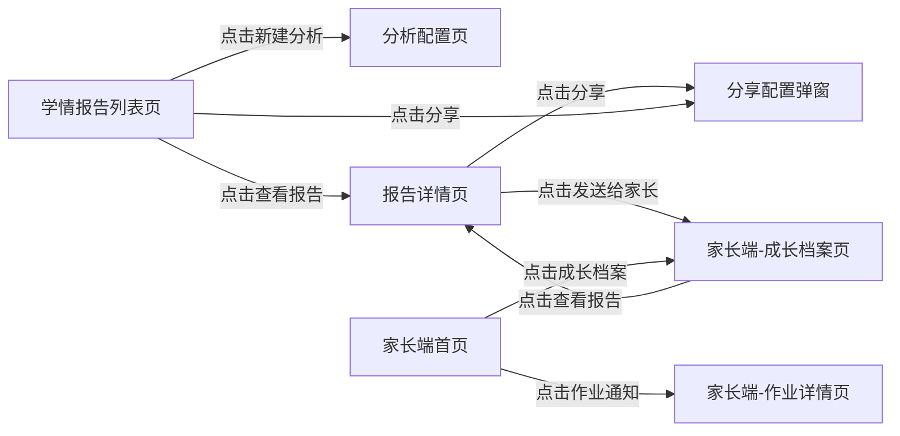

---
# Figma Make AI 生成配置说明
> 【重要】请严格按照以下要求生成原型
- **项目类型**：微信小程序原生开发原型
- **基础画布尺寸**：750px 宽度（微信小程序标准设计尺寸），高度自适应内容
- **网格系统**：8px 网格对齐，所有元素边距/尺寸为8的倍数
- **输出要求**：生成可交互高保真原型，所有组件可复用，自动添加页面跳转逻辑
---

## 全局设计规范（必须严格遵循，和原有产品保持一致）
### 颜色规范
| 颜色类型 | 色值 | 使用场景 |
|----------|------|----------|
| 主色调 | #1677FF | 主按钮、导航栏、高亮状态、链接 |
| 成功色 | #00B42A | 成功提示、正确状态标签 |
| 警告色 | #FF7D00 | 提醒通知、待处理状态 |
| 错误色 | #F53F3F | 错误提示、失败状态 |
| 标题文本 | #1D2129 | 页面标题、卡片标题、一级文本 |
| 正文文本 | #4E5969 | 普通内容、二级文本 |
| 辅助文本 | #86909C | 提示文字、次要信息、placeholder |
| 边框颜色 | #E5E6EB | 分割线、卡片边框、输入框边框 |
| 背景色 | #F2F3F5 | 页面背景、卡片悬浮背景 |
| 白色 | #FFFFFF | 卡片背景、按钮文字 |

### 字体规范（微信小程序默认字体）
| 字体层级 | 字号 | 字重 | 行高 | 使用场景 |
|----------|------|------|------|----------|
| 页面标题 | 32rpx | 600（bold） | 44rpx | 导航栏标题、页面大标题 |
| 卡片标题 | 28rpx | 500（medium） | 40rpx | 卡片标题、列表项标题 |
| 正文内容 | 26rpx | 400（regular） | 36rpx | 普通文本、正文内容 |
| 辅助文字 | 24rpx | 400（regular） | 32rpx | 提示文字、标签、次要信息 |
| 按钮文字 | 28rpx | 500（medium） | 40rpx | 所有按钮内文字 |

### 间距与圆角规范
| 类型 | 数值 | 使用场景 |
|------|------|----------|
| 页面左右边距 | 32rpx | 所有页面左右统一边距 |
| 模块间距 | 40rpx | 页面内不同功能模块之间的间距 |
| 内容间距 | 24rpx | 模块内元素之间的间距 |
| 卡片圆角 | 16rpx | 所有卡片组件统一圆角 |
| 按钮圆角 | 12rpx | 所有按钮统一圆角 |
| 输入框圆角 | 8rpx | 所有输入框统一圆角 |

### 通用组件规范（直接复用已有组件样式）
1.  **导航栏**：固定高度88rpx，背景色#1677FF，文字白色居中，左侧返回按钮
2.  **按钮组件**：
    - 主按钮：背景#1677FF，圆角12rpx，高度72rpx，文字白色，宽度100%
    - 次要按钮：边框1rpx #1677FF，背景白色，文字#1677FF
    - 小型按钮：高度56rpx，文字24rpx
3.  **卡片组件**：背景白色，圆角16rpx，阴影0 2rpx 12rpx rgba(0,0,0,0.08)，内边距32rpx
4.  **列表组件**：高度88rpx，左右边距32rpx，底部边框1rpx #E5E6EB，右侧箭头icon
5.  **输入框组件**：高度72rpx，边框1rpx #E5E6EB，圆角8rpx，内边距0 24rpx，文字26rpx

---

## 页面结构定义（共7个新增页面，按以下顺序生成）
---

### 页面1：学情报告列表页
**页面路径**：`/pages/analysis/report-list`
**页面标题**：学情报告
**布局结构**：
| 区域 | 位置 | 高度 | 内容说明 |
|------|------|------|----------|
| 顶部导航栏 | 顶部固定 | 88rpx | 左侧返回按钮，中间标题"学情报告"，右侧筛选icon |
| 筛选区域 | 导航栏下方 | 120rpx | 三个筛选器横向排列： 1. 班级选择下拉框（默认"请选择班级"，选中后显示班级名称） 2. 报告类型筛选：下拉选项「全部/时间维度/知识点维度」 3. 时间筛选：下拉选项「近7天/近30天/本学期/自定义」 |
| 报告列表区域 | 筛选区下方 | 自适应 | 卡片式列表，卡片间距24rpx，每个卡片内容： 【卡片头部】 • 左侧：报告标题（28rpx 加粗，如"2026年春季上半学期学情分析报告"） • 右侧：类型标签（圆角12rpx，背景#E6F4FF，文字#1677FF，24rpx，如"时间维度"/"知识点维度"） 【卡片中部】 • 两行辅助文字：生成时间（如"2026-04-23 14:30"）、生成人（如"张老师"） 【卡片底部】 • 左侧：状态标签：   - 生成中：橙色标签，进度条显示进度   - 已生成：绿色标签   - 生成失败：红色标签 • 右侧：三个小型按钮横向排列：「查看」「分享」「删除」 |
| 悬浮按钮 | 页面右下角，固定 | 112rpx | 圆形悬浮按钮，背景#1677FF，白色"+"图标，文字"新建分析"在按钮下方 |

**交互说明**：
- 点击筛选器弹出对应选择弹窗
- 点击报告卡片「查看」按钮 → 跳转【报告详情页】
- 点击报告卡片「分享」按钮 → 弹出【分享配置弹窗】
- 点击「删除」按钮 → 弹出确认弹窗，确认后删除报告
- 点击右下角「新建分析」按钮 → 跳转【分析配置页】

---

### 页面2：分析配置页
**页面路径**：`/pages/analysis/config`
**页面标题**：新建学情分析
**布局结构**：
| 区域 | 位置 | 高度 | 内容说明 |
|------|------|------|----------|
| 顶部导航栏 | 顶部固定 | 88rpx | 左侧返回按钮，中间标题"新建学情分析" |
| 分析类型选择 | 导航栏下方 | 120rpx | 两个tab选项卡横向排列，宽度各50%： • 选中态：底部横线#1677FF，文字#1677FF • 未选中：文字#86909C 选项1：「按时间分析」，选项2：「按知识点分析」 |
| 配置区域（按时间分析态） | 类型选择下方 | 自适应 | • 时间范围选择：   快捷选项按钮组（横向滚动）：「本周」「本月」「上半学期」「全学期」「自定义」   按钮样式：未选中白色边框，选中背景#1677FF白色文字 • 学生范围选择：   标题"选择分析的学生"，下方学生列表，支持多选，每个学生前面有复选框   顶部快捷选择：「全选」「反选」按钮 |
| 配置区域（按知识点分析态） | 类型选择下方 | 自适应 | • 教材选择：三个级联下拉框：版本→年级→学科 • 知识点选择树：可展开收起的树形结构，支持多选，每个知识点前面有复选框 • 快捷选择按钮：「按单元选择」，点击后可直接选择整个单元的所有知识点 |
| 底部操作栏 | 页面底部固定 | 120rpx | 通栏主按钮「生成报告」 |

**交互说明**：
- 点击tab切换分析类型，配置区域对应切换
- 选择自定义时间范围时，弹出日期选择器
- 点击「生成报告」按钮 → 提示"报告生成中，完成后将通知您"，返回【报告列表页】

---

### 页面3：报告详情页
**页面路径**：`/pages/analysis/report-detail`
**页面标题**：学情报告详情
**布局结构**：
| 区域 | 位置 | 高度 | 内容说明 |
|------|------|------|----------|
| 顶部导航栏 | 顶部固定 | 88rpx | 左侧返回按钮，中间标题，右侧两个图标按钮：「分享」「导出PDF」 |
| 报告概览区 | 导航栏下方 | 280rpx | 卡片式布局： • 第一行：基本信息，生成时间、分析范围、涵盖作业数量 • 第二行：四个数据看板横向排列，每个看板包含：   数值（36rpx 加粗） + 文字说明（24rpx 灰色）   看板1：班级平均分、看板2：及格率、看板3：优秀率、看板4：知识点平均掌握率 |
| 内容tab栏 | 概览区下方 | 88rpx | 四个tab横向排列：「班级整体」「学生个体」「横向对比」「教学建议」，选中态下划线高亮 |
| 内容区域（班级整体tab） | tab栏下方 | 自适应 | • 知识点掌握率排行榜：柱状图，X轴为知识点名称，Y轴为掌握率0-100% • 分数段分布：饼图，分段：90+、80-89、70-79、60-69、<60 • 错题Top10列表：每行显示知识点、错误率、易错点说明 |
| 内容区域（学生个体tab） | tab栏下方 | 自适应 | • 学生排名列表：每行显示排名、学生姓名、总分、掌握率，支持点击展开 • 展开后显示：强弱项分析（绿色标签强项、红色标签弱项）、错题汇总、得分趋势小图 |
| 内容区域（横向对比tab） | tab栏下方 | 自适应 | • 平行班平均分对比：柱状图，多个班级对比 • 知识点掌握率雷达图：多个知识点跨班对比 |
| 内容区域（教学建议tab） | tab栏下方 | 自适应 | • 系统自动生成的建议列表，每条建议前面有蓝色圆点标记 • 底部「编辑」按钮，点击可修改补充建议 |
| 底部操作栏 | 页面底部固定 | 120rpx | 三个按钮横向排列：「发送给家长」「加入组卷」「布置作业」 |

**交互说明**：
- 点击tab切换不同内容区域
- 点击知识点可跳转至错题库对应知识点页面
- 点击「分享」按钮 → 弹出【分享配置弹窗】
- 点击「发送给家长」→ 确认后批量发送给对应学生家长
- 点击「加入组卷」→ 跳转至组卷页面
- 点击「布置作业」→ 跳转至个性化作业布置页面

---

### 页面4：我的分享管理页
**页面路径**：`/pages/share/manage`
**页面标题**：我的分享
**布局结构**：
| 区域 | 位置 | 高度 | 内容说明 |
|------|------|------|----------|
| 顶部导航栏 | 顶部固定 | 88rpx | 左侧返回按钮，中间标题"我的分享" |
| 分享列表 | 导航栏下方 | 自适应 | 卡片式列表，每个卡片内容： • 顶部：分享内容标题（28rpx 加粗） • 中部：   短链URL：灰色背景条，右侧「复制」按钮   两行信息：访问密码：xxxx | 有效期：xxxx-xx-xx   访问统计：累计访问X次，最近访问时间 • 底部：   左侧状态标签：「有效」（绿色）/「已过期」（灰色）/「已废止」（红色）   右侧操作按钮：「修改密码」「延长有效期」「废止」「查看日志」 |

**交互说明**：
- 点击「复制」按钮 → 复制短链到剪贴板，提示"复制成功"
- 点击「修改密码」→ 弹出密码修改弹窗
- 点击「延长有效期」→ 弹出有效期选择弹窗
- 点击「废止」→ 确认弹窗，确认后链接失效
- 点击「查看日志」→ 弹窗显示访问日志列表：IP、设备、访问时间、状态

---

### 页面5：分享配置弹窗（通用组件）
**组件类型**：居中弹窗，遮罩层半透明黑色
**弹窗尺寸**：宽度680rpx，高度自适应
**弹窗内容**：
| 区域 | 内容说明 |
|------|----------|
| 标题 | 顶部标题"分享学情报告"，关闭按钮在右上角 |
| 密码设置 | 标题"设置访问密码"，输入框默认填充4位随机数字，右侧「刷新」按钮可重新生成，提示文字"访问者需要输入此密码才能查看报告" |
| 有效期设置 | 标题"设置有效期"，单选按钮组：「1天」「7天」「30天」「本学期有效」「永久」，默认选中7天 |
| 同步家长选项 | 开关按钮，标题"同步给报告涉及的学生家长"，提示文字"开启后家长无需密码即可查看自己孩子相关内容" |
| 链接生成区 | 短链URL显示框，右侧「复制」按钮，下方二维码图片，提示"扫码直接访问" |
| 底部按钮 | 通栏主按钮「完成」 |

---

### 页面6：家长端-成长档案页
**页面路径**：`/pages/parent/archive`
**页面标题**：孩子成长档案
**布局结构**：
| 区域 | 位置 | 高度 | 内容说明 |
|------|------|------|----------|
| 顶部导航栏 | 顶部固定 | 88rpx | 左侧返回按钮，中间标题，右侧下拉框选择学期 |
| 概览区 | 导航栏下方 | 240rpx | 卡片式布局： • 左侧：孩子头像（80rpx圆形）、姓名、班级 • 右侧：四个小数据看板：当前学期平均分、班级排名、总掌握率、错题总数 |
| 内容tab栏 | 概览区下方 | 88rpx | 四个tab：「学习趋势」「知识点掌握」「错题汇总」「报告记录」 |
| 内容区域（学习趋势tab） | tab栏下方 | 自适应 | • 得分趋势折线图：X轴为周/月，Y轴为分数 • 班级排名变化趋势图：X轴为周/月，Y轴为排名 |
| 内容区域（知识点掌握tab） | tab栏下方 | 自适应 | • 知识点掌握率雷达图 • 强弱项列表：绿色标签显示强项（>80%）、红色标签显示弱项（<60%） |
| 内容区域（错题汇总tab） | tab栏下方 | 自适应 | 按知识点分类的错题列表，每行显示知识点、错题数量、掌握率，点击可查看错题详情 |
| 内容区域（报告记录tab） | tab栏下方 | 自适应 | 老师分享的学情报告列表，点击可查看完整报告 |
| 底部按钮 | 页面底部 | 120rpx | 主按钮「导出PDF」 |

---

### 页面7：家长端-作业详情页
**页面路径**：`/pages/parent/homework-detail`
**页面标题**：作业详情
**布局结构**：
| 区域 | 位置 | 高度 | 内容说明 |
|------|------|------|----------|
| 顶部导航栏 | 顶部固定 | 88rpx | 左侧返回按钮，中间标题"作业详情" |
| 作业基本信息 | 导航栏下方 | 160rpx | 卡片式： • 作业名称、布置时间、完成时间 • 批改结果：得分（红色加粗大号字体）、正确率、老师评语 |
| 错题详情区 | 基本信息下方 | 自适应 | 逐题展示： • 题目内容（支持图片显示） • 学生答案（红色标记错误） • 正确答案（绿色标记） • 解析文字 |
| 推荐练习区 | 错题详情下方 | 自适应 | 标题"推荐类似练习"，3-5道同类型练习题列表，右侧「打印」按钮 |
| 底部按钮 | 页面底部 | 120rpx | 主按钮「已了解，标记已读」 |

**交互说明**：
- 点击「标记已读」→ 状态同步给老师，返回上一页

---

### 页面8：外部报告访问H5页
**页面类型**：手机端H5页面，宽度375px
**页面标题**：学情报告访问
**布局结构**：
1.  **未授权状态**：
    - 页面居中卡片：
      - 报告基本信息：名称、生成时间、所属班级
      - 密码输入框，提示"请输入访问密码"
      - 「提交」按钮
      - 底部提示文字"密码错误5次后将暂时限制访问"
2.  **已授权状态**：
    - 和小程序【报告详情页】内容完全一致，底部增加提示"本报告仅用于教学用途，禁止转发传播"
    - 页面禁用右键、禁用复制、禁用打印

---

## 页面跳转逻辑（自动添加交互）

---

## 生成完成后要求
1.  所有页面按照上述路径命名，层级清晰
2.  所有交互跳转逻辑正确可点击
3.  所有组件整理到Figma组件库中，可复用
4.  生成页面流程图，展示页面之间的跳转关系
